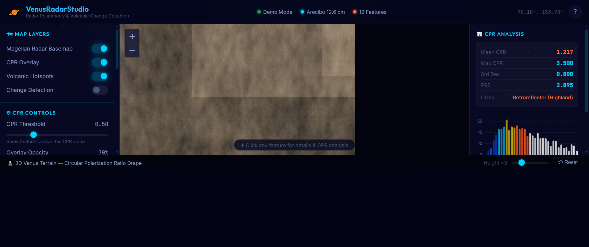

# 🪐 VenusRadarStudio

**Interactive Venus Radar CPR & Volcanic Change Detection Platform**

[](https://mirzamuzzamilbaig.github.io/VenusRadarStudio/)
[](https://python.org)
[](https://flask.palletsprojects.com)
[](LICENSE)
[](https://science.nasa.gov/venus/)

> 🚀 **Live Interactive Web App:** [https://mirzamuzzamilbaig.github.io/VenusRadarStudio/](https://mirzamuzzamilbaig.github.io/VenusRadarStudio/)
>
> A full-stack interactive web application for Venus radar science — combining **Circular Polarization Ratio (CPR)** analysis, **multi-epoch volcanic change detection**, and an immersive space-themed dashboard grounded in peer-reviewed planetary science.



---

## 🌋 Science Foundation

| Paper | Key Contribution |
|-------|-----------------|
| Campbell & Campbell 2022 (*PSJ*) | Arecibo 12.6 cm radar maps of Venus 1988–2020, CPR analysis |
| Herrick & Hensley 2023 (*Science*) | First confirmed volcanic activity detection via Magellan change detection |
| Nature Astronomy 2024 | Ongoing volcanic activity evidence (Idunn Mons, Phoebe Regio) |
| JGR Planets 2025 | Plume volcanism evolution at Atla Regio |
| VERITAS/EnVision Mission Papers | Future radar mission planning & priority targets |

### CPR Physics
**CPR = SCP / OCP** (Circular Polarization Ratio)
- Measures surface roughness relative to radar wavelength (Arecibo: 12.6 cm)
- **CPR < 0.2** → Smooth basaltic plains
- **CPR 0.2–0.5** → Moderate terrain, pahoehoe flows
- **CPR 0.5–0.9** → Rough aa-type lava flows, tesserae
- **CPR > 0.9** → Active volcanic zones, retroreflectors
- **CPR > 1.5** → Maxwell Montes coherent backscatter

---

## ✨ Features

### 🗺️ Interactive Venus Map (Leaflet.js)
- Synthetic Magellan-like radar basemap (2048×1024 px)
- RGBA CPR overlay with plasma colormap
- 12 volcanic hotspots with animated markers (pulsing for active features)
- Magellan change detection event overlays
- Click any location for instant CPR statistics

### 📊 CPR Analysis Panel (Chart.js)
- Real-time CPR histogram on map click
- Mean/Max/Std/P95 readouts
- Terrain classification (Plains → Retroreflector)
- Scientific interpretation text

### 🗻 3D Terrain Viewer (Three.js)
- Full Venus heightmap with vertex color CPR drape
- Orbit controls (drag to rotate, scroll to zoom)
- Adjustable height exaggeration (1× – 10×)
- Atmospheric glow and star field

### 📚 Literature Panel
- 18 peer-reviewed Venus radar papers
- Citation counts, open-access badges
- DOI-linked paper cards

### 🌋 Volcanic Feature Database
| Feature | Type | CPR Peak | Active |
|---------|------|---------|--------|
| Maat Mons | Shield Volcano | 1.25 | ✅ |
| Maxwell Montes | Mountain Range | 1.85 | — |
| Atla Regio | Volcanic Rise | 0.72 | ✅ |
| Sapas Mons | Shield Volcano | 0.95 | — |
| Beta Regio | Volcanic Rise | 0.88 | ✅ |
| Idunn Mons | Shield Volcano | 0.88 | ✅ |
| ... | ... | ... | ... |

---

## 🚀 Quick Start

### Prerequisites
- Python 3.10+
- Git

### Installation

```bash
# Clone the repository
git clone https://github.com/mirzamuzzamilbaig/VenusRadarStudio.git
cd VenusRadarStudio

# Install dependencies
pip install -r app/requirements.txt

# Start the server (generates Venus maps on first run, ~15 s)
python app/main.py
```

Then open **http://localhost:5000** in your browser.

### Windows One-Click
Double-click **`start.bat`** — it installs dependencies and launches the server automatically.

---

## 📁 Project Structure

```
VenusRadarStudio/
├── app/
│   ├── main.py              ← Flask API server
│   ├── radar_engine.py      ← CPR computation, synthetic data, volcano DB
│   ├── data_loader.py       ← PDS4/demo data router
│   └── requirements.txt     ← Python dependencies
├── frontend/
│   ├── index.html           ← Main dashboard (Leaflet + Chart.js + Three.js)
│   ├── css/style.css        ← Dark space glassmorphism theme
│   └── js/app.js            ← Complete interactive controller
├── papers/                  ← Downloaded research papers (PDFs)
├── top_q1_venus_papers.json ← Literature metadata (18 papers)
├── Venus_data.ipynb         ← Exploratory data analysis notebook
├── start.bat                ← Windows one-click launcher
└── README.md
```

---

## 🔌 API Endpoints

| Endpoint | Method | Description |
|----------|--------|-------------|
| `/` | GET | Main dashboard HTML |
| `/api/basemap` | GET | Synthetic Magellan radar PNG (2048×1024) |
| `/api/cpr_layer` | GET | CPR overlay RGBA PNG |
| `/api/terrain_data` | GET | 3D heightmap JSON (256×128) |
| `/api/hotspots` | GET | Volcanic features as GeoJSON |
| `/api/changes` | GET | Magellan change events as GeoJSON |
| `/api/literature` | GET | Research paper metadata JSON |
| `/api/cpr_stats?lat=&lon=` | GET | CPR statistics for a map location |

---

## 🔬 Demo Mode vs Real Data

**Current mode: Demo** — Synthetic CPR arrays seeded with real Venus statistics from Campbell & Campbell (2022).

To use **real Arecibo PDS4 data**:
1. Download from [NASA PDS4 Archive](https://pds-geosciences.wustl.edu/missions/arecibo/venus.htm)
2. Update `app/data_loader.py` to point to your `.img` files
3. Restart the server

---

## 🛰️ Related Missions
- **VERITAS** (NASA Discovery) — SAR + InSAR + emissivity mapping
- **EnVision** (ESA) — VenSAR + VenSpec
- **DAVINCI** (NASA Discovery) — Atmosphere descent probe

---

## 📖 Literature

Full bibliography in [`top_q1_venus_papers.json`](top_q1_venus_papers.json).  
Key references:
- Campbell, B. A., & Campbell, D. B. (2022). *Arecibo Radar Maps of Venus from 1988 to 2020*. PSJ, 3(55).
- Herrick, R. R., & Hensley, S. (2023). *Surface changes observed on a Venusian volcano during the Magellan mission*. Science, 379(6629), 1205–1208.
- Garvin, J. B. et al. (2022). *Revealing the Mysteries of Venus: The DAVINCI Mission*. PSJ, 3(117).

---

## 🧑‍💻 Author

**Mirza Muhammad Muzzamil**  
[](https://github.com/mirzamuzzamilbaig)

---

## 📄 License

MIT License — see [LICENSE](LICENSE) for details.

---

*Built with ❤️ for Venus planetary science exploration.*
